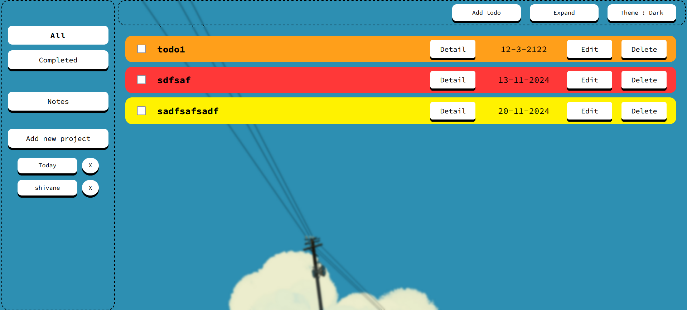
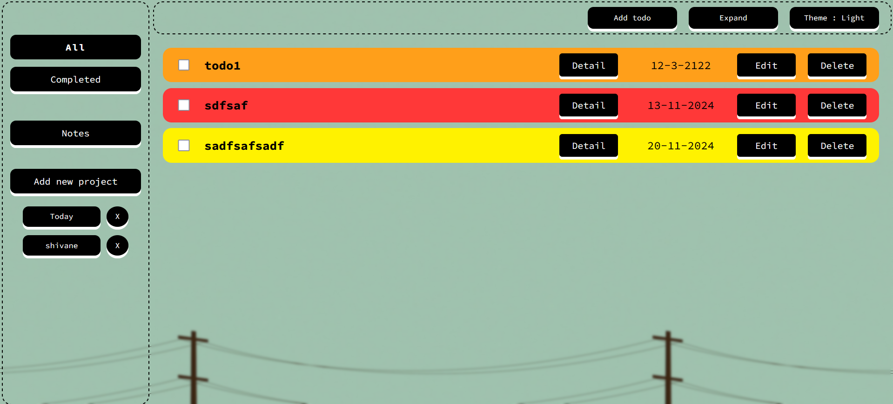

# Todov2

A feature-rich todo application to help you stay organized and on track with your tasks! This project allows you to create, edit, and manage todos, categorize them by priority and due date, and group related tasks into projects. It includes light and dark themes for ease of use at any time of day.

## Features

- **Create Notes**: Add notes related to your tasks to keep track of important information.
- **Add Todos with Date**: Organize tasks with a due date, making it easy to manage deadlines.
- **Priority Levels**: Three priority levels (High, Medium, Low) to help you focus on the most important tasks.
- **Project Management**: Create projects to group and organize specific todos.
- **Completed Todos Tab**: Easily access completed tasks in a dedicated tab to track your progress.
- **Dark and Light Themes**: Switch between dark and light themes to suit your environment and preference.
- **Edit Functionality**: Update and edit your todos and notes anytime.
- **local Save**: All changes made are saved in localStorage for ease of use.

## Screenshots

### Light Theme

| Description      | Screenshot                           |
|------------------|--------------------------------------|
| Home Page        |  |

### Dark Theme

| Description      | Screenshot                           |
|------------------|--------------------------------------|
| Home Page        |  |
